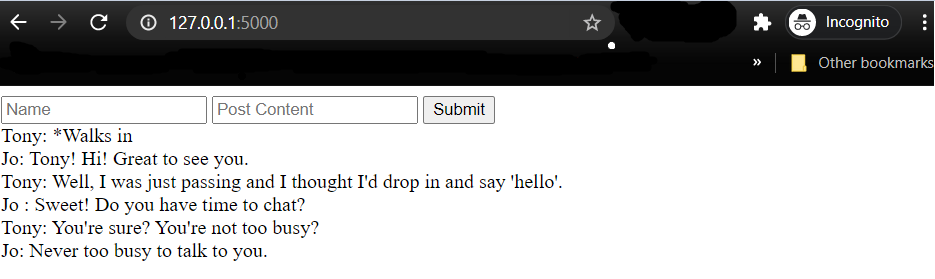

# Social-Network Full Stack Project (Flask)
Emulates an online chatroom

## Built With

* [Python3](https://www.python.org/downloads/)
* [Flask](https://flask.palletsprojects.com/en/1.1.x/)
* [SQLite](https://www.sqlite.org/index.html)
* [HTML](https://html.com/)

## If you're using Windows
* [Bash](https://www.youtube.com/watch?v=xzgwDbe7foQ&t=313s)

## Getting Started

## License

This project is licenced under the MIT License - see the [LICENSE](LICENSE) file for details.
 
